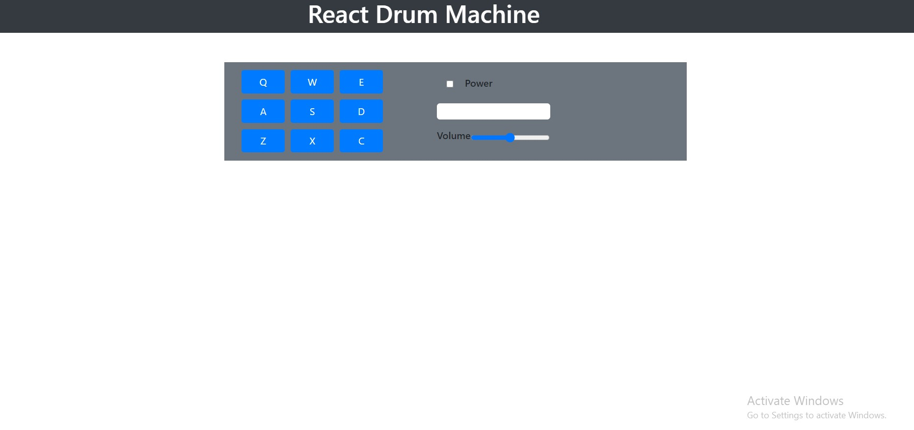

# React Drum Machine

<a href="https://csb-bwge2u-lyer4o4yq-ahmadrazach.vercel.app/">Live Demo</a>

Basic Features:

- clicking on the button will make sound
- Power on/off the drum machine
- altering volume of the sound
-

Technologies used:

- HTML
- CSS
- Javascript
- ReactJS
- Bootstrap

Modules used:

- react-bootstrap
- create-react-app
