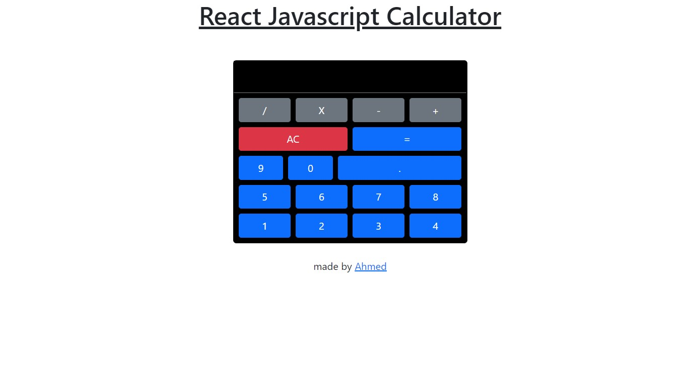

# React Bootstrap Calculator

<a href="https://csb-jledbf-lslrudwtx-ahmadrazach.vercel.app/">Live Demo</a>

Basic Features:

- Basic calculator

Technologies used:

- HTML
- CSS
- Javascript
- ReactJS
- Bootstrap

Modules used:

- react-bootstrap
- create-react-app
